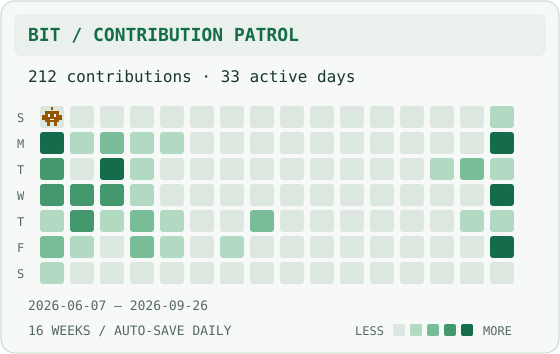

<picture>
  <source media="(prefers-color-scheme: dark)" srcset="assets/terminal-dark.svg">
  
</picture>

I build APIs, connect services and work on the screens that bring them to life.
Based in **Minas Gerais, Brazil**, with professional experience since **2022** in payment platforms, retail systems and tax-related solutions.

Most of my work starts on the backend. It rarely stays there.

[LinkedIn ↗](https://www.linkedin.com/in/guilherme-reis-829a021b5/) · [Explore my repositories ↗](https://github.com/GuilhermeReiis?tab=repositories)

### `01` / Tools behind the code

**APIs & services** — TypeScript, Node.js, NestJS · PHP, Laravel<br>
**Interfaces** — Angular · Vue, Nuxt<br>
**Data** — PostgreSQL, MongoDB

### `02` / Select a project

**Payment integration** · NestJS + Angular + MongoDB<br>
JWT authentication, a charge management interface and invoice operations connected to the Lytex API.<br>
[Backend →](k) · [Frontend →]()

**Virtual store** · Nuxt + Pinia + Laravel<br>
Product and category management, search filters and a shopping cart that survives a page refresh.<br>
[Frontend →]() · [API →]()

**Products, stores & prices** · NestJS + Angular + PostgreSQL<br>
A product catalog with pagination, filters and prices associated with individual stores.<br>
[API →](i) · [Frontend →]()

### `03` / After the commit

Meet **Bit**, the little bot on patrol through my contribution graph. Every lit tile is a day I contributed; brighter tiles mean more activity.

<picture>
  <source media="(prefers-color-scheme: dark)" srcset="assets/contributions-dark.svg">
  
</picture>

<sub>16 weeks of real activity · refreshed daily · an animated replay, no controls required.</sub>

<details>
<summary><code>./side-quest</code> — one bug before you go</summary>

The cart total is `"10020"`. It should be `120`. Where did it go wrong?

```ts
const subtotal = "100";
const shipping = 20;
const total = subtotal + shipping;
```

<details>
<summary>Reveal the fix</summary>

`+` concatenates when one operand is a string. Convert and validate the value at the boundary:

```ts
const amount = Number(subtotal);
if (subtotal.trim() === "" || !Number.isFinite(amount)) {
  throw new Error("Invalid subtotal");
}
const total = amount + shipping; // 120
```

For real payments, use integer minor units or a decimal library with explicit rounding rules.

**Bug fixed. You may now close the extra 37 tabs.**

</details>
</details>

---

**Have an API to build or a system to untangle?**<br>
Open to backend and full stack opportunities. [Let's talk on LinkedIn →](https://www.linkedin.com/in/guilherme-reis-829a021b5/)

<!-- You inspected the source. We will probably get along. -->
